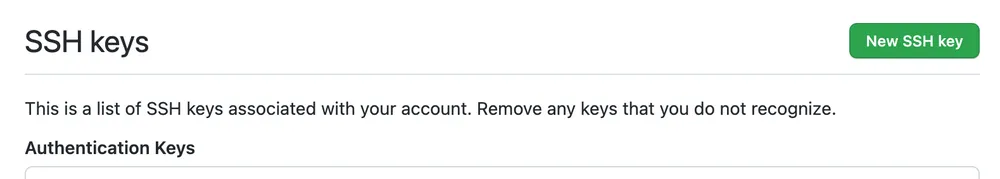
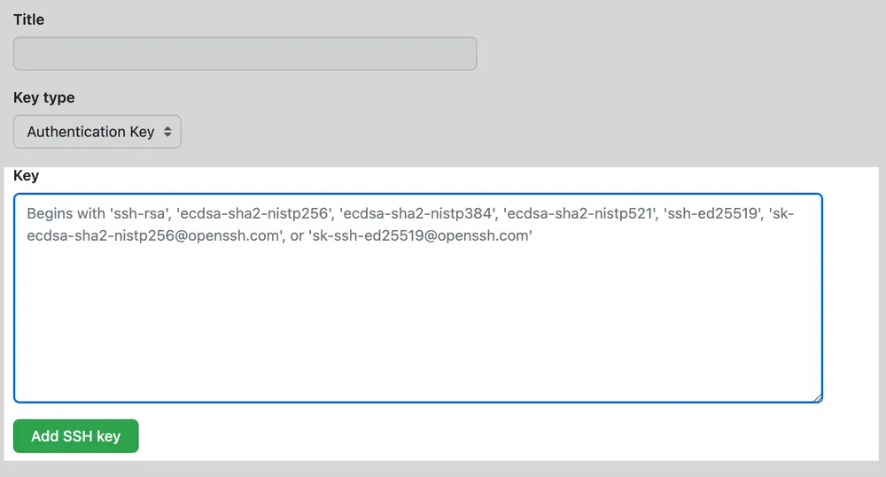

# Setup SSH Key 
all operation under Linux system
## Generate an SSH Key for an Account 

the email address has to be the same with the email you register on github

~~~
$ ssh-keygen -t ed25519 -C "user@email.com"
~~~ 

When you are prompted to "Enter a file in which to save the key", press Enter to accept the default file location. 
(if the file name already exists, you can modify file name here to avoid overwriting)

~~~
Generating public/private ed25519 key pair.
Enter file in which to save the key (/HOME/PATH/.ssh/id_ed25519): /HOME/PATH/.ssh/id_ed25519
~~~

When you are prompted to type a passphrase, press Enter

~~~
Enter passphrase (empty for no passphrase): 
Enter same passphrase again: 
~~~

SSH public key file will be stored in default path(~/.ssh/xxx.pub)

## Registering the New SSH Keys with the ssh-agent 
To use the keys, we have to register them with the **ssh-agent** on our computer.
~~~
$ eval "$(ssh-agent -s)"
$ ssh-add id_ed25519
$ ssh-add -l # check by this command 
~~~

## Adding a New SSH Key to Your Account
After adding a new SSH authentication key to your account on GitHub.com, you can reconfigure any local repositories to use SSH.

## Copy the SSH Public Key to your clipboard
SSH public key is usually in default path ~/.ssh/
~~~
cd ~/.ssh
cat id_ed25519
~~~
and copy the public key 
## Paste the Public Key to GitHub Setting
### Find the setting

### Create a new ssh key

### Paste your ssh key in below
name the title as you want 

## Create the SSH config File 
if config already exists, just modify it. However, if not, create a config file.
~~~
$ cd ~/.ssh/
$ vim config 
~~~
Write down these information below in config file. 
~~~
# Personal account
Host github.com-username
   HostName github.com
   User git
   IdentityFile ~/.ssh/id_ed25519   
~~~

reference:

[[1]](https://docs.github.com/en/authentication/connecting-to-github-with-ssh/generating-a-new-ssh-key-and-adding-it-to-the-ssh-agent)

[[2]](https://docs.github.com/en/authentication/connecting-to-github-with-ssh/adding-a-new-ssh-key-to-your-github-account)

[[3]](https://chiahsien.github.io/post/how-to-use-different-ssh-key-for-different-github-account/)